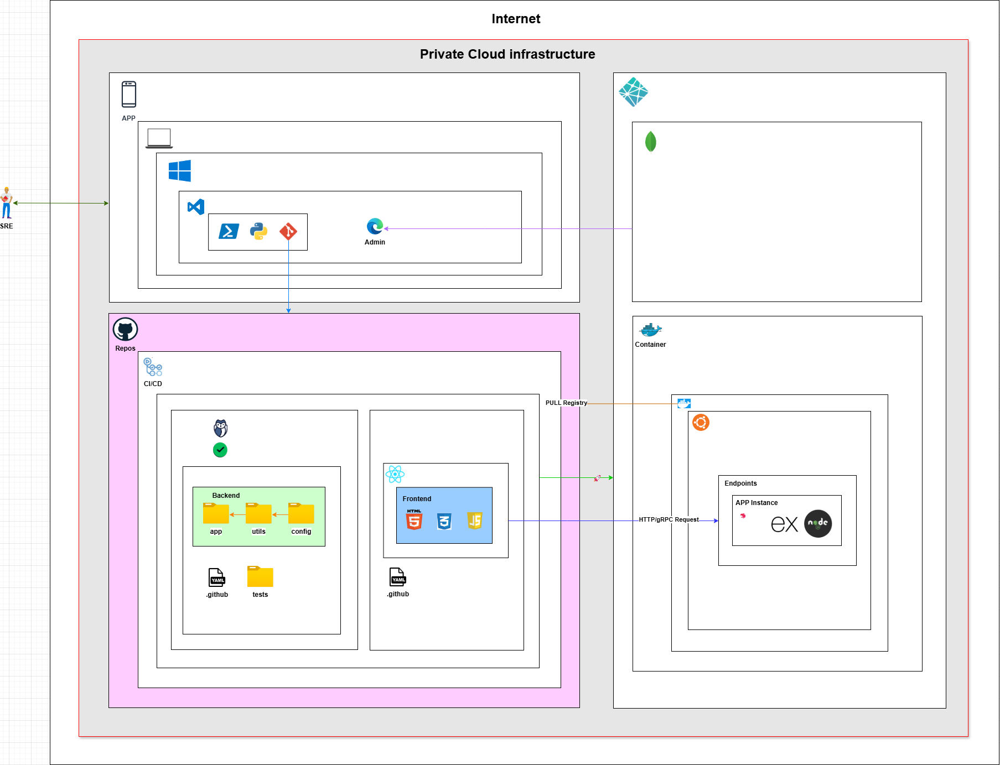

# 🏗️ Cloud Architecture

This document describes the recommended cloud architecture for the MVP SaaS, covering AWS, Azure, and GCP. 🌍

---

## 🌐 Architecture Overview

The architecture is designed for scalability, security, and cost efficiency using **Docker** containers and **Kubernetes**. Each client has its own isolated environment, ensuring **data separation, security, and optimized performance**.

---

## 🔑 Key Components

- **Frontend**: Deployed on a CDN service (e.g., [AWS S3](https://aws.amazon.com/s3/), [Azure Blob Storage](https://azure.microsoft.com/en-us/products/storage/blobs/)) with [React](https://reactjs.org/).
- **Backend**: [NestJS](https://nestjs.com/) + [Express](https://expressjs.com/) running in [Docker](https://www.docker.com/) containers.
- **Database**: NoSQL solutions like [MongoDB](https://www.mongodb.com/) or [CosmosDB](https://azure.microsoft.com/en-us/products/cosmos-db/).
- **Authentication**: [OAuth2.0](https://oauth.net/2/) for secure access.
- **Load Balancer**: Cloud-native solutions such as [AWS ALB](https://aws.amazon.com/elasticloadbalancing/), [Azure Load Balancer](https://azure.microsoft.com/en-us/products/load-balancer/), or [Google Cloud Load Balancer](https://cloud.google.com/load-balancing).

---

## 🌍 Cloud Providers

- **🟡 AWS** → EKS, DynamoDB, Cloud Storage
- **🔵 Azure** → AKS, CosmosDB, Blob Storage
- **🔴 GCP** → GKE, Firestore, Cloud Storage

---

## 🔧 Core Services

- **🚀 Kubernetes** (EKS, AKS, GKE) for container orchestration.
- **💾 Databases**: NoSQL-based storage solutions (MongoDB, CosmosDB, Firestore).
- **📡 API Gateway & Load Balancing**: Nginx, Cloud Load Balancers, or API Gateway solutions.
- **🔹 CI/CD Pipelines**: Automated deployments via GitHub Actions, GitLab CI/CD, or Jenkins.
- **🔹 Auto-scaling & Cost Optimization** strategies implemented.

---

## 📊 Diagrams

---

## 📈 Scalability and Cost Optimization

- **Auto-scaling**: Kubernetes Horizontal Pod Autoscaler (HPA) to adjust resources dynamically.
- **Multi-Tenancy**: Isolation per client for enhanced security and performance.
- **Serverless Consideration**: Cloud Functions or Kubernetes-native functions for event-driven workflows.
- **Cost Optimization**: Efficient resource allocation and FinOps best practices.

For more details, check [`scalability.md`](./scalability.md). ⚡

---
